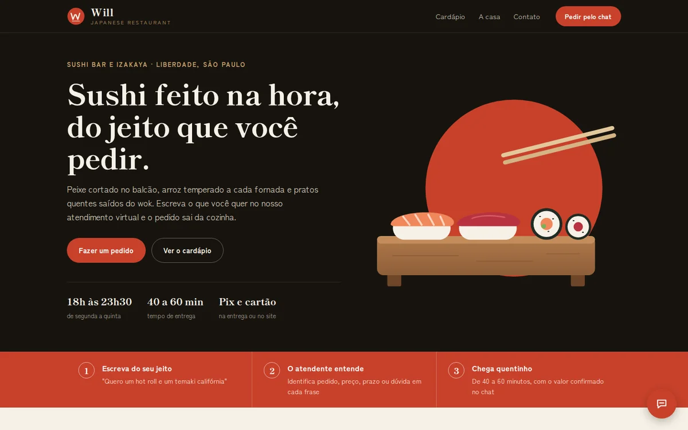
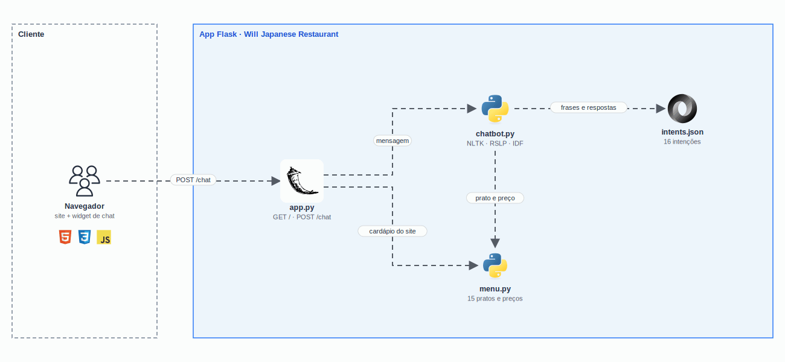

<h1 align="center">
  CP2 - Chatbot de pedidos com NLP
</h1>

<p align="center">
  
</p>

<p align="center">
  <a href="https://skillicons.dev">
    
  </a>
</p>

## Qual a finalidade do projeto?

Checkpoint 2 da disciplina de **Inteligência Artificial** (FIAP, outubro de 2025). O projeto é o site do restaurante fictício **Will Japanese Restaurant** com um **chatbot de pedidos** que entende o que o cliente escreve e responde de acordo com a **intenção** da mensagem: pedido, cardápio, preço, prazo de entrega, reclamação e outras.

O reconhecimento é feito com **processamento de linguagem natural** em Python (NLTK). A mensagem é separada em frases, cada frase é tokenizada, limpa e reduzida ao radical das palavras, e o bot compara o resultado com as frases de exemplo de cada intenção. Uma mesma mensagem pode ter **várias intenções**, e o chat mostra qual foi detectada em cada frase e com que confiança.

O enunciado pedia 8 intenções com pelo menos 15 frases de exemplo e 4 respostas cada, processamento de várias frases por mensagem e um front web. A entrega tem **16 intenções**.

## Arquitetura

<p align="center">
  
</p>

## O que foi construído

### Intenções

| Grupo | Intenções |
|---|---|
| Obrigatórias do checkpoint | `cumprimento`, `compra`, `itens_disponiveis`, `precos`, `tempo_entrega`, `agradecimento`, `reclamacao`, `despedida` |
| Restaurante | `localizacao`, `horario_funcionamento`, `forma_pagamento`, `promocoes_ofertas`, `eventos_grupos` |
| Cardápio | `ingredientes_qualidade`, `informacoes_nutricionais`, `curiosidades_cultura` |

São **16 intenções**, com **2.291 frases de exemplo** e **114 respostas** em `intents.json`.

### Como o bot entende a mensagem

| Etapa | Como funciona |
|---|---|
| Separação de frases | Quebra em `.`, `!`, `?` e `;`, e também em vírgula ou "e" quando o trecho seguinte começa uma nova pergunta ou pedido ("Oi, quanto custa o temaki e em quanto tempo chega?" vira três frases) |
| Pré-processamento | Minúsculas, sem acento e sem pontuação; tokenização do NLTK; *stopwords* em português, mantendo palavras que mudam o sentido (qual, quanto, onde, quando, não) |
| Radicais | *Stemmer* RSLP do NLTK, próprio para português: "custa", "custam" e "custo" viram o mesmo radical |
| Pratos à parte | Os nomes dos pratos são tirados antes da comparação e tratados pelo cardápio; assim "quanto custa o hot roll" é decidido por "quanto custa" |
| Similaridade | Jaccard ponderado por IDF (palavras que aparecem em poucas intenções pesam mais), combinado com a cobertura da frase de exemplo; a nota da intenção é a média das 3 frases mais parecidas |
| Reserva | Se a nota fica abaixo de 15%, entra uma busca por palavras-chave; sem nada, a resposta é "não entendi" |

### Respostas com o cardápio

| Mensagem | Resposta |
|---|---|
| "Quanto custa o sushi de atum e o hot roll?" | O preço de cada prato citado |
| "Quanto custa o temaki?" | A faixa de preço e a lista dos temakis |
| "Quero um hot roll e um temaki califórnia" | Pedido anotado com os dois pratos e os valores |
| "Quero um combo salmão, quanto custa?" | Usa o prato citado antes na mesma mensagem |
| "Quero pedir um temaki" | Lista os temakis e pergunta qual |

O cardápio fica em `menu.py` (15 pratos em 4 categorias) e é o mesmo que o site mostra.

### Site e chat

| Parte | Como funciona |
|---|---|
| Site | Hero, como pedir, cardápio montado pelo `menu.py`, a casa e contato, com ilustrações próprias em SVG |
| Cardápio clicável | Clicar num prato abre o chat e já envia "Quero um ..." |
| Chat | Abre com uma animação curta de opacidade, sem `blur` nem `backdrop-filter`; mostra "digitando" enquanto espera e traz atalhos de perguntas |
| Intenção e confiança | Cada resposta mostra a intenção de cada frase e a probabilidade |

### Rotas

| Rota | O que faz |
|---|---|
| `GET /` | Site do Will Japanese Restaurant com o widget do chat |
| `POST /chat` | Recebe `{ "message": "..." }` e devolve resposta, intenções e confiança (400 para mensagem vazia ou com mais de 500 caracteres) |
| `GET /intents` | Lista as intenções carregadas |

### Correções feitas na revisão

| Problema encontrado nos testes | Correção |
|---|---|
| "Quanto custa o temaki?" era entendido como pedido, e várias intenções extras nunca eram reconhecidas (pix, promoção, horário) | Radicais, peso IDF, pratos tratados à parte e frases de exemplo que estavam na intenção errada removidas |
| A separação por vírgula nunca funcionava (a regex exigia espaço antes da vírgula) | Nova separação por vírgula e "e" seguidos de início de pergunta |
| "Olá! Boa noite!" às vezes respondia dois cumprimentos | Cumprimento respondido uma vez por mensagem |
| Com NLTK 3.9 o tokenizador pedia o recurso `punkt_tab`, que não era baixado | Download do `punkt_tab` e NLTK atualizado |
| `debug=True` fixo e mensagem de exceção devolvida ao cliente | Debug só com `FLASK_DEBUG=1` e erro 500 genérico |
| Foto do topo do site com link quebrado e dados de contato que pareciam reais | Ilustrações próprias e contato fictício |

Nas 37 frases de teste usadas antes da revisão, o bot acertava 28; agora acerta todas.

## Tecnologias utilizadas

- **Python 3.12 + Flask 3:** API do chatbot e página do site;
- **NLTK 3.9:** tokenização, *stopwords* em português e *stemmer* RSLP;
- **HTML, CSS e JavaScript:** site responsivo e widget de chat, sem bibliotecas no front;
- **Shippori Mincho B1 e Zen Kaku Gothic New:** tipografia do site (Google Fonts);
- **pytest e ruff:** 58 testes e lint, rodando no **GitHub Actions**.

## Estrutura do repositório

```text
fiap-ia-cp2/
├── app.py               # Flask: site, /chat e /intents
├── chatbot.py           # NLP: frases, pré-processamento, similaridade e respostas
├── menu.py              # Cardápio: pratos, preços e apelidos
├── intents.json         # Intenções, frases de exemplo e respostas
├── templates/home.html  # Site com o widget do chat
├── static/
│   ├── css/style.css    # Estilos do site e do chat
│   ├── js/chat.js       # Chat: envio, "digitando" e intenções
│   └── img/             # Selo e ilustrações em SVG
├── tests/               # Testes do chatbot e das rotas
├── docs/                # Demo e diagrama
├── .github/workflows/   # CI: ruff e pytest
└── requirements.txt
```

## Fluxo de funcionamento

1. O cliente escreve no chat (ou clica num prato do cardápio) e o front envia `POST /chat`.
2. O `chatbot.py` separa a mensagem em frases.
3. Em cada frase, procura os pratos do `menu.py` e classifica a intenção pelo restante do texto.
4. Para pedido e preço, a resposta usa o prato e o valor do cardápio; nas outras intenções, sorteia uma resposta do `intents.json`.
5. O front mostra a resposta, a intenção de cada frase e a confiança.

## Como rodar

```bash
python3 -m venv .venv && source .venv/bin/activate
pip install -r requirements.txt
python app.py                  # http://localhost:5000
```

Na primeira execução o NLTK baixa `punkt_tab`, `stopwords` e `rslp`. Para ligar o modo debug do Flask: `FLASK_DEBUG=1 python app.py`. A porta pode ser trocada com `PORT=8000`.

O `chatbot.py` também roda sozinho no terminal: `python chatbot.py`.

## Como validar a entrega

```bash
pip install pytest
pytest -v                      # 58 testes
```

Frases para testar no chat (saída real):

| Frase | Intenções detectadas |
|---|---|
| "Oi, quanto custa o temaki?" | `cumprimento` 78%, `precos` 68% |
| "Quero um hot roll e um temaki califórnia" | `compra` 68%, com os dois pratos anotados |
| "Boa noite, quero sushi de atum e também gostaria de saber o tempo de entrega." | `cumprimento`, `compra`, `tempo_entrega` |
| "O pedido chegou frio" | `reclamacao` 47% |
| "Vocês aceitam pix?" | `forma_pagamento` 60% |
| "Que horas vocês fecham?" | `horario_funcionamento` 39% |
| "Muito obrigado, tchau!" | `agradecimento`, `despedida` |

Pontos principais de validação:

- cada resposta mostra a intenção e a confiança;
- mensagens com mais de uma frase recebem uma resposta para cada frase;
- pedidos e perguntas de preço usam os valores do cardápio.

O restaurante, as ilustrações e os dados de contato são fictícios.

---

## Autor

**William Coelho** · RM 556336 · [@willtechdev](https://github.com/willtechdev)
